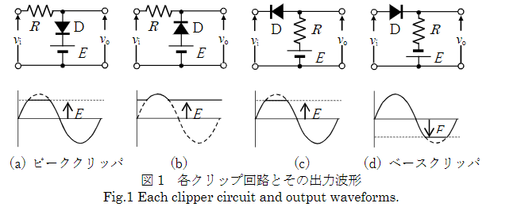
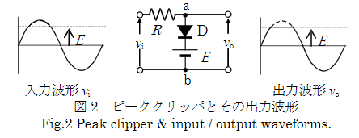
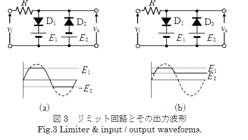

# 1.目的
振幅操作回路として用いられるクリッパ，リミッタおよびクランパの振幅操作の原理を理解する．また，各種マルチバイブレータの波形を観測し，その動作原理を理解する

達成目標
+ 振幅操作（波形整形）回路の原理を説明できる．
+ 各種マルチバイブレータの原理を説明できる．
+ 各回路の働きを理論と実験で確かめることができる．

# 2. 理論
##  2.1.振幅操作回路
クリッパ，リミッタ，クランパなどは，いずれも振幅操作（波形整形）回路と呼ばれるもので，パルス信号が伝わる途中で歪んだり，雑音が混入したりするときに，もとの一定のパルス波に整形する場合などに用いられる．
これらの回路は，ダイオード（非線形素子），抵抗，コンデンサおよびバイアス電源などから構成され，ダイオードの非直線性（理想的にはオン時の内部抵抗が零，オフ時の内部抵抗が無限大）を利用して振幅操作を行う．
##  2.2.クリップ回路（Clipper）
図1のようにある波形の上または下の部分を切り取ることをクリッピング（Clipping）といい，その回路をクリップ回路という．
または，リミッタ(Limiter)という場合もある．同図のDはダイオードで，いずれも正弦波を入力とし，これをクリッピングしたときの出力波形を示す 。
Dはその両端が順方向の電圧になったときにオンし，逆方向のときはオフするスイッチとして動作する．

図2において，入力電圧viは抵抗Rを通してab間に加わるが，vi＜Eの間はDにはE-viの逆方向電圧が加わり，Dはオフして，出力電圧voはviとなる。
逆にvi≧Eになると，Dにはvi-Eの順方向電圧計が加わりDはオンして，vo=Eとなる。
従って，同図のように出力電圧は上端をEでクリップされた波形となる。
このように，波形の上部を切り取る回路をピーククリッパといい，図1(d)のように波形の下部を切り取る回路をベースクリッパと呼ぶ．

### 2.1.2リミット回路（Limiter）
図3のようにクリップ回路を二つ組み合わせると，波形の上部および下部を切り取り，途中を取り出すリミット回路ができる。
または，スライサ(Slicer)ともいう．

~~~math

\sqrt{x^{2}+y^{2}}=r

~~~

$$ \sqrt{x^(2) + y^(2)} = r $$

|       | 可変抵抗 Rv_1 | 可変抵抗Rv_2 | file      |
|-------|-----------| ------- |-----------|
| クリップ前 | 1.980V    | null | file0.png |
| クリップ後 | 1.980V    | null | file1.png |
| クリップ前 | null      | -2.340V | file2.png |
| クリップ後 | null      | -0.1mV | file3.png |

### 2.1.3クランプ回路（Clamper）
